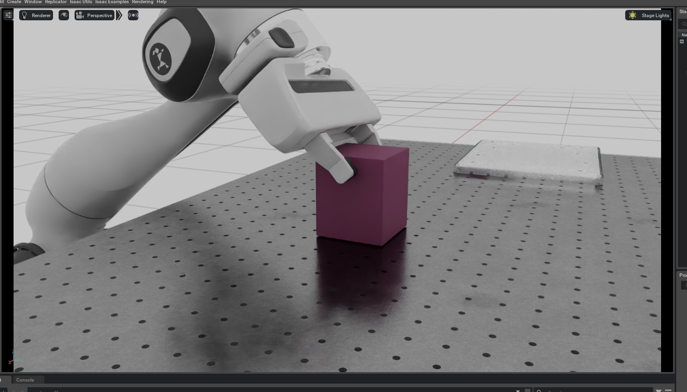
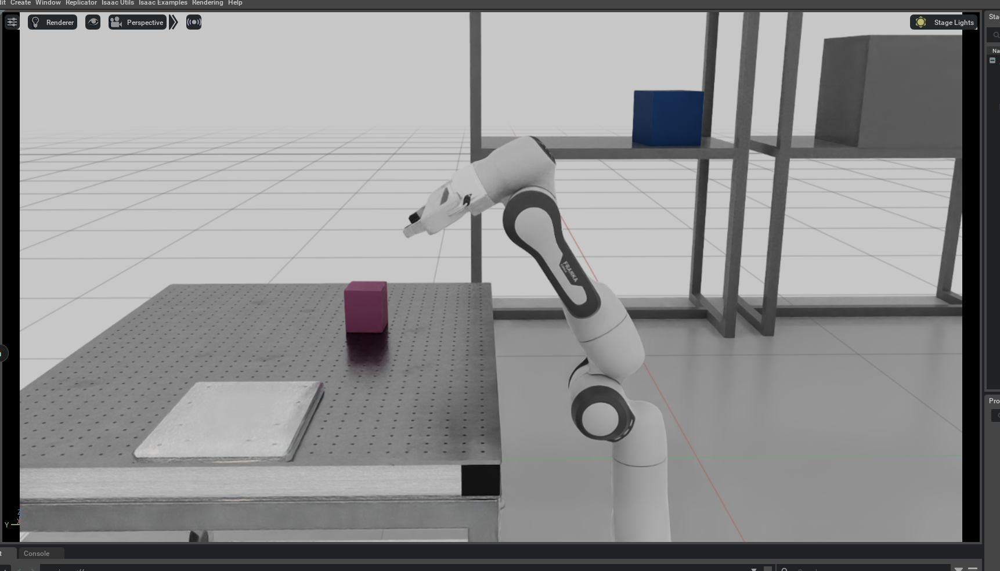
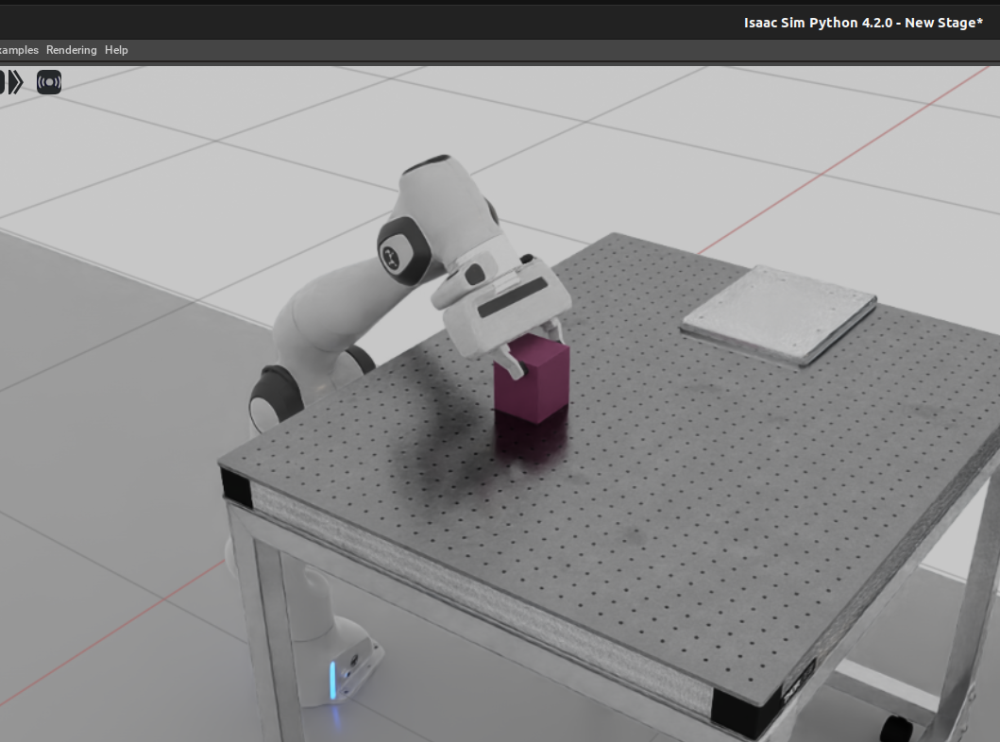

# Isaac Sim Franka Pick-and-Place

> A physics-stable Franka pick-and-place system in NVIDIA Isaac Sim, demonstrating OpenUSD scene composition, coordinate system reconciliation, and contact-stable robotic manipulation using smooth joint-space interpolation.

## Demo


**Full video:** [franka_pick_place_demo.mp4](./media/franka_pick_place_demo.mp4)

## 📸 Scene & Grasp Setup

**Hover Pose**


**Grasp Alignment**


**Placement Result**


---

## Overview

This project implements a scripted Franka pick-and-place sequence in Isaac Sim using a referenced OpenUSD tabletop scene.

Key focus areas:
- OpenUSD scene composition
- Y-up to Z-up runtime reconciliation
- articulated robot placement
- grasp sequencing
- lift stability
- smooth, non-yanking joint-space motion

## Portfolio Description

Implemented a scripted Franka pick prototype in Isaac Sim using a Z-up runtime stage and a referenced Y-up OpenUSD environment, debugging articulation placement, frame conventions, grasp sequencing, and lift stability through interpolated joint-space motion.

---

## 🧠 System Architecture

### OpenUSD Composition Strategy

* Runtime stage: **Z-up, metersPerUnit = 1.0**
* Referenced environment authored in **Y-up**
* Applied corrective transform via wrapper:

```python
wrapper_xf.AddRotateXOp().Set(90.0)
```

✔ Prevents re-authoring source USD
✔ Maintains non-destructive pipeline design

---

### Scene Organization

```
/World
 ├── EnvWrapper   (referenced + rotated environment)
 └── Franka       (articulation root)
```

✔ Clear separation of authored vs runtime data
✔ Matches scalable digital twin architecture patterns

---

## 🤖 Manipulation Pipeline

### Deterministic Sequence

1. Hover (pre-grasp alignment)
2. Descend (approach pose)
3. Close gripper
4. Stabilization hold
5. Smooth lift (interpolated)
6. Translate (joint-space)
7. Controlled descent
8. Release
9. Retreat without re-contact

---

## ⚙️ Motion Control Strategy

### Joint-Space Control (No IK)

Used:

* `ArticulationAction`
* Direct joint position targets

Why:

* Fully deterministic
* Easier to debug than IK/planners
* Ideal for understanding physics interaction

---

### Smooth Motion (Critical Breakthrough)

Initial problem:

* Cube slipped during lift
* Caused by abrupt velocity spike (“yank”)

### Solution: Interpolation

```python
alpha = (i + 1) / lift_steps
blended = (1 - alpha) * close_positions + alpha * lift_positions
```

✔ Eliminates impulse forces
✔ Maintains contact stability
✔ Produces physically believable motion

---

## 🧪 Physics & Grasp Debugging

### Observed Failures

* Cube not following gripper after closure
* Visual contact ≠ physical attachment
* Object slipping despite correct alignment

---

### Root Causes Identified

* Insufficient friction/contact behavior
* Motion acceleration too aggressive
* Incorrect timing between:

  * grasp
  * lift
* Scale mismatch (cube vs gripper aperture)

---

### Fixes Applied

* Reduced cube size to match gripper geometry
* Added **post-grasp stabilization delay**
* Slowed lift via interpolation
* Maintained grip during retreat phase
* Prevented re-contact after release

---

## 🧠 Debugging Truths (High-Value Insights)

> These are the kinds of lessons that matter in production pipelines.

* **Simulation ≠ animation**
* Contact physics is timing-sensitive, not just positional
* Smooth motion is more important than grip strength
* Visual correctness can hide physical failure
* Coordinate mismatches silently break systems

---

## 📁 Project Structure

```
Project_02/
├── scripts/
│   ├── franka_pick_baseline_working.py
│   └── robotics_starter.py
├── usd/
│   └── robotics_starter_v05_small_cube.usda
├── media/
│   └── franka_pick_place_demo.mp4
├── images/
│   ├── Screenshot from 2026-03-27 00-37-09.png
│   ├── Screenshot from 2026-03-27 00-44-57.png
│   └── Screenshot from 2026-03-27 01-15-14.png
```

---

## 🚀 What This Demonstrates

* OpenUSD scene composition and coordinate reconciliation
* Isaac Sim articulation control
* Physics-aware robotic manipulation
* Debugging of contact-based interactions
* Transition from motion scripting → stable manipulation

---

## 🔮 Next Steps

* Replace joint-space control with IK / motion planning
* Add grasp detection (contact sensors or perception)
* Tune physics materials (friction, restitution)
* Introduce multiple objects / clutter
* Integrate camera + perception pipeline (Cosmos-ready path)

---

## 🌐 Digital Twin Relevance

This project represents a foundational pattern in digital twin systems:

* Simulated environment (USD scene)
* Actuated system (robot articulation)
* Interaction via physics (contact + motion)
* Deterministic control loop

This is directly extensible to:

* warehouse robotics
* manufacturing automation
* synthetic data generation
* sim-to-real pipelines

---

## 🧠 Key Takeaway

> Stable robotic manipulation emerges from the interaction of motion, timing, and physics — not from position alone.

---

## 🧪 Tools Used

* NVIDIA Isaac Sim
* OpenUSD (Pixar USD)
* Python (for PointInstancer setup)

---

## 🧠 Author

Dartayous Hunter - Digital Twin Engineer (NVIDIA-focused)

---
